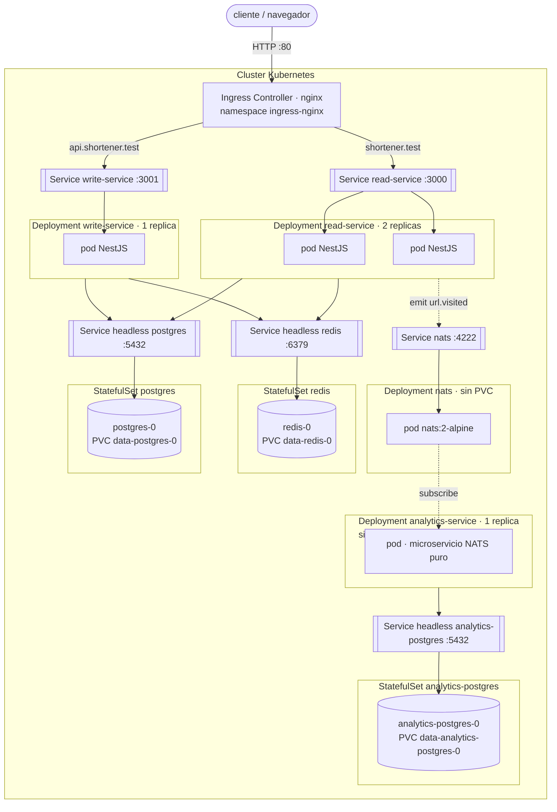
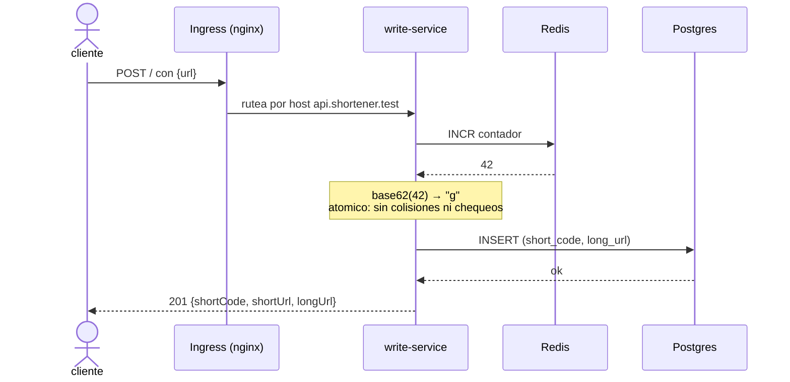
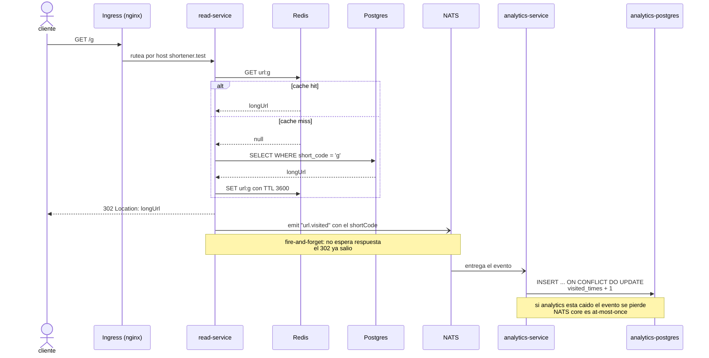

# url-shortener

Acortador de URLs partido en 3 microservicios NestJS, desplegado en Kubernetes.
Proyecto de aprendizaje: el objetivo es practicar separación por responsabilidad
(escritura / lectura / analítica), caché, mensajería asincrónica y manifests de k8s.

- `POST /` sobre `api.shortener.test` → crea un short code.
- `GET /:code` sobre `shortener.test` → responde `302` a la URL original.
- Cada visita emite un evento; `analytics-service` lo consume y agrega el contador.

Monorepo con pnpm workspaces: las dependencias se instalan una vez en la raíz y
el schema de la base compartida vive en `packages/db-schemas`.

```
url-shortener/
├── package.json          # scripts raíz
├── pnpm-workspace.yaml   # workspaces
├── docker-compose.yml    # build de imagenes + stack local
├── k8s/                  # manifests del cluster
├── packages/db-schemas/  # schema drizzle compartido (tabla urls)
├── write-service/        # NestJS · HTTP
├── read-service/         # NestJS · HTTP
└── analytics-service/    # NestJS · microservicio NATS
```

---

## Arquitectura

Qué corre en el cluster y quién le habla a quién.
Flechas llenas = sincrónico. Flechas punteadas = asincrónico.



### Servicios

| Servicio | Puerto | Expuesto por Ingress | Descripción |
| --- | --- | --- | --- |
| `write-service` | 3001 | `api.shortener.test` | Genera el short code y persiste la URL. 1 réplica: el contador vive en Redis, no en el pod. |
| `read-service` | 3000 | `shortener.test` | Resuelve el short code y redirige. Lectura con caché en Redis. 2 réplicas: es stateless y se lleva casi todo el tráfico. |
| `analytics-service` | — | no expuesto | Microservicio NATS puro, sin servidor HTTP. Consume `url.visited` y agrega los clicks en su propia base. |

Cada servicio tiene su `.env.example` con las variables que espera (sin valores).

### Datos

| Componente | Rol |
| --- | --- |
| `postgres` (StatefulSet + PVC) | Tabla `urls`: `short_code` PK, `long_url`, `created_at`. Schema compartido en `packages/db-schemas`. |
| `analytics-postgres` (StatefulSet + PVC) | Tabla `visited`: `short_code` PK, `visited_times`, `first_visited_at`, `last_visited_at`. Base aparte: analytics no comparte estado con el core. |
| `redis` (StatefulSet + PVC) | Dos usos distintos: contador `url:counter` para generar códigos, y caché `url:<code>` con TTL de 1h. |
| `nats` (Deployment, sin PVC) | Broker de eventos. Sin persistencia a propósito: NATS core es at-most-once. |

---

## Flujos

### Escritura — `POST /`



### Lectura y evento de analítica — `GET /:code`

El click se registra sin bloquear la redirección.



---

## Decisiones de diseño

**Short code con `INCR` de Redis + base62.** `INCR` es atómico, así que dos
requests concurrentes nunca reciben el mismo número. No hace falta generar un
código random, chequear si ya existe y reintentar. El costo: los códigos son
secuenciales y por lo tanto enumerables.

**El Redis del contador corre con AOF, no con snapshots RDB.** RDB guarda cada
60s/300s/3600s; si Redis se cae, el contador retrocede y el próximo `INSERT`
choca contra la PK.

**Escritura y lectura separadas.** El tráfico de un acortador es casi todo
lectura, y son cargas distintas: `read-service` escala a 2 réplicas,
`write-service` queda en 1. Además la lectura tiene caché y la escritura no.

**El evento de analítica es fire-and-forget.** `emit()` no espera respuesta: el
`302` sale sin esperar a NATS ni a la base de analytics. Perder un click es
aceptable; demorar la redirección no.

**Analytics tiene su propia base.** No comparte tablas ni conexión con el core.
Si se cae, la app sigue acortando y redirigiendo.

**Postgres y Redis son StatefulSets con PVC.** Como Deployments perdían los
datos en cada restart del pod.

**Imágenes con tag versionado, nunca `:latest`.** Con un tag explícito k8s usa
`imagePullPolicy: IfNotPresent` por defecto y toma la imagen local, sin intentar
bajarla de un registry.

**El contexto de build es la raíz del workspace.** Los servicios dependen de
`packages/db-schemas`, que vive fuera de su carpeta.

---

## Correr en local

```bash
pnpm install                            # desde la raíz, instala todo
pnpm dev                                # los 3 servicios en watch, en paralelo
pnpm --filter write-service start:dev   # uno solo
```

Con Docker Compose (postgres + redis + los dos servicios HTTP):

```bash
docker compose up -d
```

> Compose todavía no levanta NATS ni analytics, están comentados. Para probar el
> flujo de analítica, usar el cluster.

Migraciones (drizzle-kit, corren contra la base desde el host):

```bash
pnpm --filter write-service db:generate     # genera SQL desde el schema
pnpm --filter write-service db:migrate      # aplica
pnpm --filter analytics-service db:migrate  # base de analytics, schema propio
```

## Desplegar en Kubernetes

Requiere un cluster local con ingress-nginx instalado.

```bash
pnpm images        # docker compose build: construye las imagenes con su tag
kubectl apply -f k8s/
```

Los hosts resuelven por Ingress, así que hay que apuntarlos a la IP del ingress
controller en `/etc/hosts`:

```
127.0.0.1  shortener.test api.shortener.test
```

Probar:

```bash
curl -X POST http://api.shortener.test/ \
  -H 'Content-Type: application/json' \
  -d '{"url":"https://example.com"}'

curl -i http://shortener.test/g     # → 302 Location: https://example.com
```

`k8s/secret.yaml` está versionado con credenciales de ejemplo (`admin/admin`)
porque es un proyecto de aprendizaje sobre un cluster local. En `k8s/examples/`
está la plantilla sin valores.

## Limitaciones conocidas

- **No hay forma de leer las métricas.** `analytics-service` escribe en su base
  pero no expone HTTP ni Service: hoy se consultan con `psql` contra el pod.
- **Eventos at-most-once.** NATS core sin JetStream ni PVC: si analytics está
  caído cuando llega el evento, el click se pierde.
- **`POST /` no valida la URL.** Cualquier string entra a la base.
- **Sin probes ni resource limits** en los Deployments.
- **Códigos enumerables** por ser un contador secuencial.
